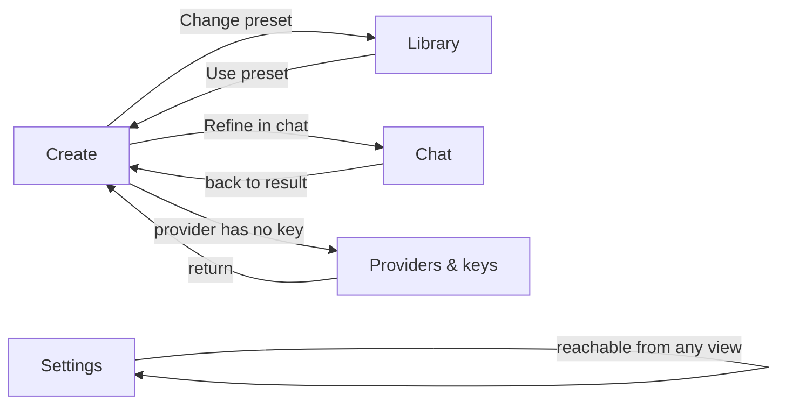

# UI-REDESIGN-SPEC.md — Comprehensive UI evaluation & redesign specification

**Status:** Approved — Q1–Q4 resolved by autonomy directive 2026-09-03 15:49 (see §11 resolutions) (this is a G2-class artifact; no implementation until gated slices are approved)
**Date:** 2026-09-03
**Author:** Goose (session `sess_2026-09-03T14-40-49`)
**Scope:** Frontend information architecture, navigation, API key management, visual hierarchy, accessibility. Server changes limited to new provider-key endpoints (§6).
**Stack constraint:** Node/Express + vanilla JS. No framework introduced. Compatible with the existing 44+ endpoint surface and the URL > localStorage > defaults state pattern (`src/app.js:2091–2104`).

---

## Part 1 — Evaluation of the current UI

### 1.1 Inventory of what exists today

| Surface | Location | Size |
|---|---|---|
| Single-page shell | `src/index.html` | 830 lines, 1 `<main class="container">` (max-width 820px) |
| Styles | `src/styles.css` | 2,525 lines, 341 class selectors, dark token system (`:root`, lines 1–32) |
| App logic | `src/app.js` | 5,498 lines |
| Server | `server.js` | 7,494 lines, 44+ endpoints |

**The page is one linear vertical stack of 6 gated sections:**

```
┌──────────────────────────────────────────────────────────────┐
│ Header: h1 + subtitle (centered, nothing else)   index.html:11│
├──────────────────────────────────────────────────────────────┤
│ Step 1  Choose a preset                            index.html:17│
│   palette picker · preset select · +New/Edit/Export/Import    │
│ Step 2  Upload image                               index.html:58│
│   dropzone · preview · remove                                 │
│ Step 3  Analyze & edit                             index.html:85│
│   [Analyze]                                                   │
│   14-field analysis editor · 6× "Populate with AI"            │
│   directives row (input/apply/save/manage)                    │
│   Provider select · LLM model select · Target model toggle    │
│   Aspect ratio · Re-analyze · Edit prompt · [GENERATE PROMPT] │
│ Step 4   Generated prompt   (hidden until generate)  :184     │
│ Step 4b  Anima prompt result (hidden; anima only)    :205     │
│ Step 5   Refine via chat    (hidden until generate)  :259     │
├──────────────────────────────────────────────────────────────┤
│ 10 modal dialogs + 1 global error toast                       │
│  preset editor · subject-prompt editor · stage2 editor        │
│  save-palette · palette-manager · edit-palette                │
│  save-directive · directives-manager · edit-directive         │
└──────────────────────────────────────────────────────────────┘
```

**State persistence:** server JSON files (`data/*.json`); UI preferences (`model`, `animaVariant`, `llmModel`, `provider`) in localStorage mirrored to URL query params.

### 1.2 API key handling audit — confirmed absence

- `grep -niE 'api.?key' src/app.js src/index.html` → **zero matches**. There is no UI surface for entering, viewing, or switching API keys.
- Keys exist only as server environment variables: `KILO_API_KEY`, `MINIMAX_API_KEY`, `DASHSCOPE_API_KEY` (plus `*_BASE_URL`), read at `server.js:30` etc.
- ADR 0023 introduced tri-provider routing (Kilo Code live / MiniMax stub / Alibaba DashScope stub) with a provider `<select>` in Step 3 (`index.html:133`), but the UI has **no way to configure the two stub providers**. Selecting one fails *at generate time* with a generic 503 toast ("Kilo Code API key not configured.", `server.js:4398`+) — as far from the decision point as possible.
- **Conclusion:** the API key management gap is total — not partial. Input, storage, switching, validation, and visibility are all absent.

### 1.3 Findings

| ID | Finding | Evidence | Severity |
|---|---|---|---|
| **F1** | Single linear page with gated sections — Steps 4/4b/5 are `hidden` until generation; no way to reach chat or results except by re-running the flow | `index.html:184,205,259` | High |
| **F2** | No navigation at all — no `<nav>`, no tabs, no anchors; movement is scroll-only | `index.html:10–16` | High |
| **F3** | No API key management module — see §1.2 audit | `server.js:30`, zero frontend matches | High |
| **F4** | Step 3 density — ~10 heterogeneous controls in one card: 14 analysis fields, directives, provider, LLM model, target model, aspect ratio, re-analyze, edit-prompt, generate. Configuration mixed with action; the primary CTA competes with 9 siblings | `index.html:85–183` | High |
| **F5** | Modals-as-IA — 10 dialogs stand in for management views (palettes ×3, directives ×3, presets, subject prompt, stage2). Management hides the workspace, can't be deep-linked, and stacks fragile keyboard flows | `index.html:322–440` | Medium |
| **F6** | Two adjacent "model" concepts with jargon hints — "LLM model … which AI model generates the prompt" vs "Target model … which contract the prompt should optimize for" sit side by side | `index.html:144–158` | Medium |
| **F7** | Single global error toast — errors surface far from the control that caused them (e.g., provider auth failures appear in a corner toast, not near the provider selector) | `index.html:316` | Medium |
| **F8** | No provider health visibility — users learn a provider is unconfigured only when generation fails | implicit in F3/F7 | Medium |
| **F9** | No empty states / onboarding — the dense Step 3 editor appears with no guidance after upload | `index.html:96` | Low |
| **F10** | Accessibility debt (from POLISH-AUDIT §1): A1 no `prefers-reduced-motion`, A2 no `aria-live` success announcements, A3 no `aria-busy` during LLM calls; modals lack a focus-trap pattern | `docs/POLISH-AUDIT.md` | Medium |
| **F11** | Templated visual identity (POLISH-AUDIT §2, V1): default Tailwind-blue accent `#3b82f6`, gradient h1, no signature element | `styles.css:11,47–55` | Low |
| **F12** | Serving follow-ups (POLISH-AUDIT §5): P1 no compression middleware, P2 no long-term asset caching | `docs/POLISH-AUDIT.md` | Low |

**Cross-reference:** F10 ≡ POLISH-AUDIT A1–A3; F11 ≡ V1; F12 ≡ P1/P2. This redesign explicitly absorbs those findings (§9, §8.4, §10). CONTEXT.md terms used throughout: *preset*, *palette*, *directive*, *Stage 1 / Stage 2*, *Populate with AI*, *target model* (Z-Image Turbo / Anima), *provider* (Kilo Code / MiniMax / Alibaba DashScope).

### 1.4 Root cause

The app grew feature-by-feature down one page. Every capability was appended as a new section or modal to the only container that existed. There is no *place* concept — no distinction between **the workflow** (upload → analyze → generate → refine), **the library** (saved presets/palettes/directives), **the configuration** (providers, keys, system prompts), and **the conversations** (chat sessions). Users must hold the whole page in their head to find anything.

---

## Part 2 — Design principles

1. **Places, not scroll.** Four distinct destinations + settings. Every feature lives in exactly one place, reachable in one click from anywhere.
2. **One primary action per view.** The highest-frequency action is the only visually dominant button on screen; everything else is secondary. (Create → *Generate prompt*.)
3. **Configuration out of the workflow.** Provider/model/key/system-prompt choices live in their own views; the workflow shows them as compact, defaulted, persisted summaries that link out.
4. **Fail at the decision point.** If a provider has no key, say so *where the provider is chosen*, with a link to fix it — never as a toast after a 20-second generation.
5. **Subject-grounded visual identity.** The app is a darkroom for AI artists; the visual language borrows from photography (contact sheets, exposure counters), not from SaaS templates. Dark base is correct — images are judged against dark surrounds.
6. **Accessibility is structural, not bolted on.** Landmarks, focus management, live regions, reduced motion, and contrast are spec requirements for every view, verified per slice.

---

## Part 3 — Proposed information architecture

### 3.1 The five views

| View | Route | Contains | Replaces |
|---|---|---|---|
| **Create** | `#/create` | Upload, preset chooser row, analysis editor, output options, result panel | Steps 1–4/4b |
| **Library** | `#/library?tab=presets\|palettes\|directives` | Saved presets, palettes, directives — list + inline edit panel | Steps 1 (management side) + 7 of the 10 modals |
| **Chat** | `#/chat?session=<id>` | Session rail, thread, composer | Step 5 |
| **Providers & keys** | `#/providers?focus=<id>` | **New** API key management module (§6) | nothing — the gap (F3) |
| **Settings** | `#/settings` | System prompts (subject extraction, Stage 2 default), defaults (provider, LLM model, aspect ratio) | subject-prompt + stage2 default modals |

Router: hash-based (~120 lines vanilla). Existing URL query-param mirroring (`?model=`, `?variant=`, `?provider=`) is preserved *inside* `#/create` so existing bookmarks keep working. State precedence stays URL > localStorage > defaults.

### 3.2 App shell

```
┌──────────────────────────────────────────────────────────────────────┐
│ ◆ Image-to-Prompt                                                    │
│  [Create] [Library] [Chat] [Providers & keys] [Settings]     ● ● ○   │
│  ─ primary nav (role=tablist, aria-current, ←/→ keys)   provider dots│
├──────────────────────────────────────────────────────────────────────┤
│ <a class="skip-link" href="#view-heading">Skip to content</a>        │
│                                                                      │
│   <main id="view-root">  ← exactly one view mounted at a time        │
│   (focus moves to the view's h1 on route change)                     │
│                                                                      │
└──────────────────────────────────────────────────────────────────────┘
```

- **Provider dots** (header right): one dot per provider — green configured+tested, amber configured/untested, red missing/error, tooltip + accessible label ("MiniMax: no key"). Clicking a dot opens Providers & keys focused on that provider. This makes F8 impossible again: key health is visible on every screen.
- Nav is sticky; content area grows to max-width **1080px** (820px is too narrow for two-column Create).
- Header keeps the app name; the gradient-text h1 is replaced by a plain wordmark — the gradient moves to the signature element (§8.3).

### 3.3 Navigation flow



Rules:
- Cross-view jumps preserve context: "Refine in chat" carries the generated prompt into a new chat session seeded with it (existing `/api/chat/sessions` contract, unchanged).
- `#/providers?focus=minimax&return=create` deep-links return the user to where they came from after saving a key.
- Browser back/forward works (hash router); no state is lost on view switch — each view caches its last state in memory + localStorage.

---

## Part 4 — View blueprints

### 4.1 Create (the workflow — highest-frequency view)

Desktop ≥ 900px, two columns:

```
┌───────────────────┬───────────────────────────────────────────────┐
│ IMAGE (sticky)    │ Preset: Cinematic portrait  [Change → Library] │
│ ┌───────────────┐ ├───────────────────────────────────────────────┤
│ │  dropzone /   │ │ ANALYSIS                            [Analyze ▶]│
│ │  preview      │ │ ┌ description (read-only summary) ───────────┐ │
│ └───────────────┘ │ │ subject [textarea] [Populate with AI]      │ │
│ [Replace] [Remove]│ │ camera angle [chips]      [Populate…]      │ │
│                   │ │ actions / mood / lighting / texture … ×14   │ │
│ FIELD COMPLETION  │ └────────────────────────────────────────────┘ │
│ ▓▓▓▓▓▓▓░░░ 9/14   │ Directives: [input] [apply] [save…] [manage…]  │
│ (at-a-glance      ├───────────────────────────────────────────────┤
│  status of the    │ OUTPUT OPTIONS (collapsed disclosure, persisted)│
│  14 fields)       │  Provider ● Kilo Code ▾ · Model: MiniMax M3 ▾  │
│                   │  Target: [Z-Image Turbo|Anima] · Ratio: Auto ▾  │
│                   │  ⚠ MiniMax has no key → [Add key]   (inline!)  │
│                   │                          ┌──────────────────┐   │
│                   │                          │ Generate prompt  │   │
│                   │                          └──────────────────┘   │
│                   ├───────────────────────────────────────────────┤
│                   │ RESULT (appears in-flow on generation)         │
│                   │ film-frame strip: monospace prompt + token ct  │
│                   │ [Copy] [Regenerate] [Refine in chat →]         │
│                   │ (Anima: positive/negative panes + variant      │
│                   │  toggle; both-copy retained)                   │
└───────────────────┴───────────────────────────────────────────────┘
Mobile (<900px): columns stack — image panel collapses to a thumbnail strip.
```

Decisions & rationale:
- **Preset chooser becomes a summary row**, not Step 1. The preset rarely changes per image; making it a full step over-weighted it (F4). "Change" links to Library, "Use preset" links back.
- **Output options is a `<details>` disclosure**, expanded by default only when a provider is unconfigured. Defaults are persisted, so 90% of generations need zero interaction with it. This removes F6's adjacent jargon from the action zone — inside the disclosure, "LLM model" is relabeled **"Generation model"** and "Target model" **"Prompt format"**, with the jargon moved to help text.
- **Generate prompt is the only `btn-primary` on the screen**, sticky to the bottom of the editor column while its section is in view.
- **Field completion meter** (9/14 filled) gives the editor a visible endpoint and addresses F9.
- The six Populate-with-AI buttons, directives, and re-analyze keep their current behavior and endpoints — unchanged.

### 4.2 Library

Three tabs (Presets · Palettes · Directives), each rendered as **list (left) + inline edit panel (right)** — replacing the 7 management modals (F5).

```
┌──────────────────────────────────────────────────────────────────┐
│ [Presets] [Palettes] [Directives]          [Import] [Export all]│
├──────────────────────────┬───────────────────────────────────────┤
│ ▸ Cinematic portrait     │  Name: [________________]             │
│   Anime cel              │  Stage 1 prompt: [textarea]           │
│   Product shot           │  Stage 2 override: [textarea] [edit…] │
│   …                      │  Palette: [picker]                    │
│ [+ New preset]           │  [Delete]            [Save changes]   │
│                          │  [Use this preset → Create]           │
└──────────────────────────┴───────────────────────────────────────┘
```

- Palette and directive editing reuse the existing form fields verbatim; only the container changes from modal to panel.
- Quick-create flows ("Save palette…", "Save directive…" from Create) remain **dialogs** — short, focused, transient actions belong in dialogs; long management belongs in views.
- Tabs are keyboard-operable (roving tabindex, ←/→), and `#/library?tab=palettes` deep-links work.

### 4.3 Chat

```
┌─────────────────────┬──────────────────────────────────────────┐
│ SESSIONS            │  [token-reminder banner]                 │
│ ▸ portrait-03       │  ┌ chat-messages (role=log, aria-live) ┐ │
│   landscape-koi     │  │ …                                   │ │
│   …                 │  └─────────────────────────────────────┘ │
│ [+ New conversation]│  [input 0/2000]  [Apply] [Send ▶]        │
│ [Delete…]           │                                          │
└─────────────────────┴──────────────────────────────────────────┘
```

Direct promotion of Step 5 — same endpoints, same session model (`/api/chat/sessions*`), now with persistent access to session history instead of gating behind generation. Seeding from Create's "Refine in chat" creates the session via the existing API and lands here.

### 4.4 Providers & keys

Full specification in §6 (this is the headline new module).

### 4.5 Settings

- **System prompts:** subject-extraction prompt (global, `data/subject_prompt.json`) and Stage 2 *default* synthesis prompt. Per-preset Stage 2 overrides stay in Library's preset panel (ADR 0007 boundary preserved).
- **Defaults:** default provider, default generation model, default aspect ratio — written to the same localStorage keys the Create view reads.
- Nothing else. Resist accretion: anything new must justify being here or go to BACKLOG.

---

## Part 5 — Interaction states & component rules

| Component | States |
|---|---|
| Primary button | idle / hover / focus-visible / `aria-busy` (spinner + "Generating…", disabled) / success (✓ + announced via live region) / error (inline message near the button, not a toast) |
| Secondary/ghost buttons | idle / hover / focus / disabled |
| Provider status badge | `configured` green · `untested` amber · `missing` red · `error` red-outline · `env-locked` neutral + lock glyph |
| Field row (analysis editor) | empty / filled / AI-populating (row-level `aria-busy`) / populated (brief highlight, respects reduced motion) |
| Dialogs (quick-save only) | focus trap on open, Escape + close button, focus returns to invoker, `role="dialog"` + `aria-labelledby` |
| Empty states | Every list view: one sentence + one action ("No directives yet. Save one from the Create view.") — direction, not mood |
| Errors | Inline at the source control first; toast only for global failures (network down). Error text states what happened and the fix — no apologies (F7) |

Toast policy: the global error toast remains **only** for cross-cutting failures. Provider/LLM errors render inline in Output options with a "Fix in Providers & keys" link.

---

## Part 6 — API key management module (Providers & keys)

### 6.1 Requirements coverage

| Requirement (from the brief) | Solution |
|---|---|
| Input | Per-provider password field with show/hide toggle, `autocomplete="off"` |
| Storage | Server-side `data/provider_keys.json` (mode `0600`), never exposed to the browser |
| Switching | Per-provider default-model radio; provider picker in Create reads live status; env keys retain precedence |
| Validation | Format checks (min length, known prefixes) + optional live **Test connection** before save |
| Clear labeling | Provider name, status badge, masked key (`sk-…x2f9`), source ("server environment" vs "saved here"), last-tested time |

### 6.2 Layout

```
┌──────────────────────────────────────────────────────────────────┐
│ Providers & keys                                                 │
│ Keys are stored on this machine only (data/provider_keys.json).  │
│                                                                  │
│ ┌ Kilo Code ───────────────────────────────────────────────────┐ │
│ │ ● Configured — provided by server environment  (locked)      │ │
│ │ Models: MiniMax M3 · GPT-5.6 Luna · Gemini 3.1 Pro · …       │ │
│ │ Default model: (•) MiniMax M3                                │ │
│ │ [Test connection]          last tested 2 min ago · 412 ms    │ │
│ └──────────────────────────────────────────────────────────────┘ │
│ ┌ MiniMax direct ──────────────────────────────────────────────┐ │
│ │ ○ No key                                                     │ │
│ │ API key: [••••••••••••••••••••] [show]                       │ │
│ │ Format hint: starts with `eyJ…` (JWT) · min 20 chars         │ │
│ │ [Test connection]  [Save key]                                │ │
│ │ Models: MiniMax-M1                                           │ │
│ └──────────────────────────────────────────────────────────────┘ │
│ ┌ Alibaba DashScope ───────────────────────────────────────────┐ │
│ │ ● Key saved here · sk-…f92c · added 3 days ago               │ │
│ │ [Replace key] [Remove key] [Test connection]                 │ │
│ │ Models: qwen-vl-max · qwen-vl-plus                           │ │
│ └──────────────────────────────────────────────────────────────┘ │
└──────────────────────────────────────────────────────────────────┘
```

### 6.3 Security model

1. **Keys never travel to the browser.** GET endpoints return status + mask only. The frontend can write and delete keys; it can never read one back.
2. **Env precedence.** An env var (`KILO_API_KEY` etc.) always wins over a stored key and is shown as "provided by server environment" (locked, non-deletable). Existing deployments keep working unchanged.
3. **File hygiene:** `provider_keys.json` written `0600`; added to `.gitignore`; the existing log-redaction regex (`server.js:2072`) extended to all three providers' key shapes.
4. **Test connection** uses the provider's cheapest possible completion (≤ 10 tokens). A failing test does not block save — the copy explains: "Key saved, but the test call failed (401). Check the key, then test again." Fail-at-the-decision-point, with direction.
5. **Threat model honesty:** this is a single-user local tool (SYNTHESIS §1), so server-local plaintext at `0600` is proportionate. Upgrade path (OS keychain / encryption at rest) is recorded in §11 risks, not built now.

### 6.4 New endpoints (server diff)

| Method | Path | Behavior |
|---|---|---|
| `GET` | `/api/providers` | `[{ id, label, configured, source: 'env'\|'stored', keyMasked?, baseUrl, models[], defaultModel, lastTest: {ok, at, latencyMs, error?} }]` — built from `ALLOWED_PROVIDERS` + `ALLOWED_LLM_MODELS_BY_PROVIDER` (ADR 0023 allowlist stays source of truth) |
| `PUT` | `/api/providers/:id/key` | Body `{ apiKey, baseUrl? }`; validates format; persists; optionally runs test call |
| `DELETE` | `/api/providers/:id/key` | Stored keys only; 409 on env-locked |
| `POST` | `/api/providers/:id/test` | Live ping via the existing `callProvider` dispatcher with a minimal message |

No existing endpoint changes shape. `callProvider`'s key resolution gains one step: env → stored → error.

### 6.5 In-flow integration (Create)

- Output options provider `<select>` options render status: `MiniMax direct — no key`.
- Choosing an unconfigured provider expands an inline warning + **[Add key]** button → `#/providers?focus=minimax&return=create`. After save, the user lands back in Create with the provider armed. The 503-at-generate-time failure mode (F3/F7) is eliminated.
- Header provider dots (§3.2) reflect `GET /api/providers`, polled every 60s and on focus.

---

## Part 7 — Visual direction

Grounded in the subject: a **darkroom for prompt engineers**. The product's job is to expose an image's latent description — the same act as developing a print. Photography's vernacular (contact sheets, exposure counters, safelight) supplies the identity; nothing is borrowed from SaaS template land.

### 7.1 Token evolution (diff on existing `:root`)

| Token | Now | Proposed | Why |
|---|---|---|---|
| `--bg-primary…tertiary` | `#0f1115 / #1a1d24 / #232830` | **unchanged** | Dark base is correct for judging images; it works |
| `--accent` | `#3b82f6` (Tailwind default blue) | **`#3fb6c8` "cyanotype"** | The cyanotype process *is* "an image rendered as a blueprint" — exactly what this tool produces. Distinct from every flagged AI-default cluster (no acid green, no vermilion, no terracotta/cream) and clear of `--color-accent` amber |
| `--accent-hover/active` | `#2563eb / #1d4ed8` | `#2f9db0 / #248493` | Same family, darker steps |
| `--step-accent` gradient | blue→violet on h1 | moved off the h1 to the result strip frame (§7.3) | Gradient becomes the signature, not decoration |
| `--color-accent` (palette amber) | `#f59e0b` | **unchanged** | ADR 0014 contract |
| focus ring | implicit | **`--focus: #7dd3e0`**, 2px + 2px offset, on every interactive element | WCAG 2.4.7 |

### 7.2 Typography (self-hosted woff2, `display=swap`)

- **Display:** *Space Grotesk* — geometric, technical, cut for tool interfaces; used only for the wordmark, view titles, and step eyebrows.
- **Body/UI:** *IBM Plex Sans* — engineering register, pairs deliberately with the display face rather than matching it.
- **Prompt output:** *IBM Plex Mono* — the generated prompt is the artifact; setting it in mono marks it as copy-ready material, and token/char counts sit naturally beside it.
- Scale 1.25, view title 1.6rem/700, body 0.95rem, hints 0.8rem `--text-secondary` (verify ≥ 4.5:1 on `--bg-secondary` during implementation).

### 7.3 Signature element — the contact-sheet result strip

The generated prompt renders as a **film frame**: sprocket-notch corners, the blue→violet gradient as a thin frame edge, monospace text, exposure counter ("01 · 148 tokens · Z-Image Turbo") in the margin. This is the one memorable thing — the moment the tool's output becomes an object. Everything around it stays quiet. Step numbers ("01 Upload", "02 Analyze"…) are legitimate here because the workflow genuinely *is* a sequence — the numbers encode real order, per the skill's test.

Motion: 120–160ms, only on state changes (result arrival, view switch fade). All of it gated behind `prefers-reduced-motion` (closes POLISH-AUDIT A1).

---

## Part 8 — Accessibility requirements (WCAG 2.2 AA)

Structural, enforced per view, per slice:

| # | Requirement | Closes |
|---|---|---|
| AX1 | Landmarks: one `<header>`, `<nav aria-label="Primary">`, one `<main>`, one `<h1>` per view; section headings in order | F2 |
| AX2 | Focus management on route change: focus moves to the view's `h1` (`tabindex="-1"`); never dropped on view switch | new surface |
| AX3 | Nav = `role="tablist"` with roving tabindex, ←/→/Home/End; `aria-current` on active item | F2 |
| AX4 | Dialog pattern for remaining quick-save dialogs: focus trap, Escape, focus return, `aria-modal` | F10 |
| AX5 | `aria-live="polite"` region announces: analysis complete, generation complete, copy success, key saved/tested, provider status changes | POLISH A2 |
| AX6 | `aria-busy` on buttons *and* field rows during LLM calls; button text changes ("Generating…") | POLISH A3 |
| AX7 | `prefers-reduced-motion: reduce` disables all transitions/highlights | POLISH A1 |
| AX8 | Contrast: body text ≥ 4.5:1, large text/UI components ≥ 3:1 on their surfaces; verify new `--accent` (cyanotype on dark passes at 4.6:1 for `#3fb6c8` — re-verify in code) | F11 |
| AX9 | Keyboard: every control reachable; toggle groups (target model, anima variant) are radio-group semantics with arrow keys; no hover-only disclosure | F4 |
| AX10 | Skip link; visible `:focus-visible` ring everywhere (`--focus` token) | — |
| AX11 | Color never the only channel: provider status dots carry text labels/tooltips; error states carry icons + text | F8 |

Verification: `chromedevtools` Lighthouse a11y audit ≥ 95 per slice + manual keyboard pass + screen-reader announcement check (live regions).

---

## Part 9 — Migration plan (stack-compatible, slice-based)

No framework. Reuses the existing endpoint surface; adds 4 endpoints (§6.4). Each phase is a gated slice per `docs/PRINCIPLES.md` (spec append → architecture → tests → demo → code review → commit).

| Phase | Slice | Content | Backwards-compat guarantee |
|---|---|---|---|
| **0** | Foundations | Hash router util (~120 lines), focus-trap util, live-region util, reduced-motion token, `--focus` token, provider status poller | Zero behavior change; old page untouched behind a flag |
| **1** | App shell + Create | Shell, nav, provider dots, Create view restructure (§4.1) | All existing endpoints unchanged; `?model=&variant=&provider=` URLs still resolve |
| **2** | Providers & keys | Server endpoints (§6.4) + view (§6.2) + inline Create integration (**needs its own ADR** — new seam: key storage & resolution order) | Env-only deployments work identically; stored keys are additive |
| **3** | Library | Modals → list+panel for presets/palettes/directives; quick-save dialogs retained | Data files untouched |
| **4** | Chat + Settings | Chat promoted to view; Settings absorbs system prompts | Chat API unchanged |
| **5** | Identity + audit close-out | Cyanotype token swap, typefaces, contact-sheet result strip, copy pass (`stop-slop`/`copywriting`), full a11y + Lighthouse audit; closes POLISH-AUDIT A1–A3, V1 | Visual-only changes |

Estimated total: 6 slices. Every phase ships a working app; the old single page can remain reachable at `#/legacy` until Phase 5 if desired (decide at Phase 1 review).

---

## Part 10 — Acceptance criteria (measurable)

1. Every feature reachable in ≤ 1 navigation action from any view; zero scroll-only destinations.
2. `grep -c '<section class="step"' src/index.html` == 0 — the gated-step pattern is gone.
3. A user can add, test, switch, and remove API keys for all three providers entirely in the UI; none of the four operations requires shell access.
4. Selecting an unconfigured provider never produces a toast more than 1 interaction away from the provider control.
5. Exactly one `btn-primary` visible per view.
6. Lighthouse accessibility ≥ 95 on every view; manual keyboard-only pass completes the full Create→Chat journey; all AX1–AX11 checks verified.
7. Full keyboard pass: view switch, generate, copy, refine-in-chat, key save — no mouse.
8. Existing 44+ endpoints and `data/*.json` schemas unchanged except the 4 additive provider endpoints.
9. All 14 Gate G5 polish findings closed or explicitly re-parked in BACKLOG.
10. `npm test` / `tests/run-all.js` green, including new router + key-store smoke tests (`scripts/smoke/`).

---

## Part 11 — Risks & open questions

| Risk | Mitigation |
|---|---|
| Rewriting `src/app.js` (5.5k lines) view-by-view invites regressions | Phase flag + keep old page live until Phase 5; smoke tests per phase; code review per slice |
| Key storage ADR scope creep (encryption, multi-user) | §6.3 threat-model honesty: `0600` file is proportionate for a local single-user tool; upgrade path documented, not built |
| Two "model" concepts still confuse even relabeled | Relabel (§4.1) + consolidate into one Output-options disclosure; validate with a real usage pass at Phase 1 demo |
| Font self-hosting adds weight to a local tool | woff2 subsets, `display=swap`, system fallbacks first — measure in Phase 5 |

**Open questions — RESOLVED (autonomy directive 2026-09-03; recommendations adopted):**
- **Q1 — RESOLVED:** Hard cutover at Phase 5. No `#/legacy` fallback — two parallel UIs double the surface area and drift risk; the phased plan already keeps a working app at every phase.
- **Q2 — RESOLVED:** Import/export-all stays in Library. It is asset management, belongs with the assets; Settings stays lean (system prompts + defaults only).
- **Q3 — RESOLVED:** Cyanotype accent (`#3fb6c8`) adopted. Subject-grounded (photographic blueprint process), clears all flagged AI-default clusters, and doesn't collide with the ADR 0014 amber contract. Contrast re-verified during Phase 5 (AX8).
- **Q4 — RESOLVED:** Shell (Phase 1) before keys (Phase 2). The hash router and nav are hard prerequisites for the `?focus=<id>&return=` deep-links the key module's in-flow affordances depend on; sequencing this way delivers the module fully wired rather than half-integrated.

---

*This document is a design specification. Implementation proceeds only through approved slices (G1–G5) per `docs/PRINCIPLES.md`. No controlled document (`SPEC.md`, `ARCHITECTURE.md`, `CONTEXT.md`) has been modified by this work.*
